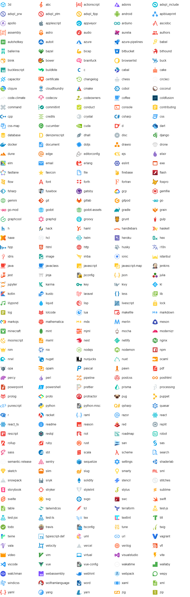

# material-file-icons

[](https://www.npmjs.org/package/material-file-icons)
[](https://github.com/simonnilsson/material-file-icons/actions?query=workflow%3Aci+branch%3Amain)
[](https://packagephobia.com/result?p=material-file-icons)

Beautiful material style file type icons packaged in a single JavaScript file.

Source of icons is the [Material Icon Theme](https://github.com/PKief/vscode-material-icon-theme) for VS Code. All credit for icon design should go there. This is also the place for placing requests for adding new icons.

> **Version 1.x of this library was React specific, since 2.0 this library is made to be framework agnostic.**
## Features

- Zero dependencies.
- Contains **377** unique icons.
- Can automatically select icon based on file name.
- Uses **SVG** images that can scale to any dimensions.
- All icons are bundled in a single file of about **475 kB** minified.
- Although primarily focused on file types used in software development, other common file types are also included.

## Install

```sh
npm install --save material-file-icons
```

## Usage Examples

React:
```js
import { getIcon } from 'material-file-icons';

function FileIcon({ filename, style, className }) {
  return <div 
    style={style}
    className={className}
    dangerouslySetInnerHTML={{ __html: getIcon(filename).svg }}
  />;
}

export default FileIcon;
```

Vue:
```html
<template>
  <div v-html="svg"></div>
</template>

<script>
  import { getIcon } from 'material-file-icons';
  export default {
    name: "FileIcon",
    props: ["filename"],
    computed: {
      svg: function () {
        return getIcon(this.filename).svg;
      }
    }
  };
</script>
```

Svelte:
```html
<script>
  import { getIcon } from 'material-file-icons';
  export let filename;
  $: selectedIcon = getIcon(filename);
</script>

<div class={$$props.class} style={$$props.style}>
  {@html selectedIcon.svg}
</div>
```

## API

### `Icon`
The Icon type definition
```ts
{
  name: string,               // The name of the icon e.g. 'javascript'.
  svg: string,                // The actual SVG content '<svg ...'.
  extensions: Array<string>?, // List of extensions this Icon should be applied to.
  files: Array<string>?       // List of complete filenames this icon should be applied to.
}
```

### `defaultIcon: Icon`
The default `file` icon.

### `getIcon(filename: string): Icon`
Returns an icon based on filename input.

### `getAllIcons(): Array<Icon>`
Returns an array of all available icons.


## Icons



## License

[MIT](LICENSE)