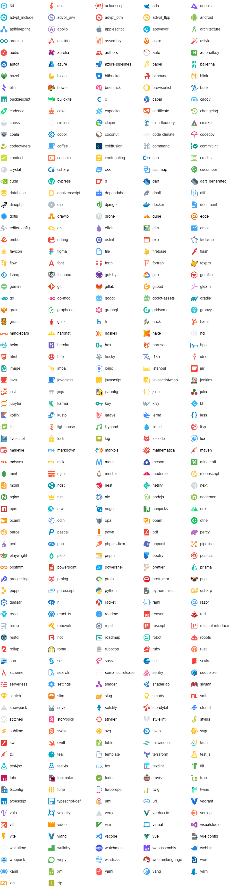

# material-file-icons

[](https://www.npmjs.org/package/material-file-icons)
[](https://github.com/simonnilsson/material-file-icons/actions?query=workflow%3Aci+branch%3Amain)
[](https://packagephobia.com/result?p=material-file-icons)

Beautiful material style file type icons in a simple React component.

Source of icons is the [Material Icon Theme](https://github.com/PKief/vscode-material-icon-theme) for VS Code. All credit for icon design should go there. This is also the place for placing requests for adding new icons.

## Features

- Contains **320** unique icons.
- Uses **SVG** images that can scale to any dimensions.
- Can automatically select icon based on file name.
- All icons a bundled in a single file of about **420 kB** minified.
- Although primarily focused on file types used in software development, other common file types are also included.

## Install

```sh
npm install --save material-file-icons
```

## Usage

```js
import { FileIcon, Icon, getIcon, getAllIcons, defaultIcon } from 'material-file-icons';

// Renders a JS icon
<FileIcon filename='file.js' />

// Renders an audio icon with a black background
<FileIcon icon={getIcon('file.mp3')} style={{ backgroundColor: 'black' }} />

// Renders a blank icon
<FileIcon />
```

### `FileIcon`
Component for rendering an icon. By default the icon will scale to fit its container. A **style** or **className** prop can be used customize size or other styling.

#### Props
|Prop name|Type|Description|
|---|---|---|
|filename|string?|Select icon automatically using a file name. Should not include file path.|
|icon|Icon?|Manually specify the icon to use. Has precedence over the filename prop.|

All other props are passed to the top `<div />` element.

### `Icon`
The Icon type definition
```ts
{
  name: string,               // The name of the icon e.g. 'javascript'.
  svg: string,                // The actual SVG content '<svg ...'.
  extensions: Array<string>?, // List of extensions this Icon should be applied to.
  files: Array<string>?       // List of complete filenames this icon should be applied to.
}
```

### `defaultIcon: Icon`
The default `file` icon.

### `getIcon(filename: string): Icon`
Returns an icon based on filename input. Can be used as prop to FileIcon or for other purposes.

### `getAllIcons(): Array<Icon>`
Returns an array of all available icons.


## Icons



## License

[MIT](LICENSE)